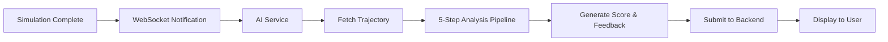

The Justina AI System provides automated, objective analysis of surgical simulations using a sophisticated 5-step machine learning pipeline. It evaluates surgical performance based on physical metrics, benchmarking against ideal patterns, and risk assessment.

## Purpose

The AI system serves multiple critical functions:

<CardGroup cols={2}>
  <Card title="Performance Evaluation" icon="chart-line">
    Objective scoring based on dexterity metrics, precision, and safety
  </Card>
  <Card title="Real-Time Feedback" icon="message">
    Immediate, actionable recommendations for surgical improvement
  </Card>
  <Card title="Risk Detection" icon="triangle-exclamation">
    Identification of critical events like hemorrhages and tumor touches
  </Card>
  <Card title="Training Analytics" icon="brain">
    Long-term performance tracking and skill progression analysis
  </Card>
</CardGroup>

## Architecture

The AI system is built as a Python microservice that integrates with the backend via REST API and WebSocket channels.



## 5-Step Analysis Pipeline

The analysis pipeline processes surgical trajectory data through five sequential steps:

<Steps>
  <Step title="Data Ingestion & Cleaning">
    Converts raw movement data into a structured pandas DataFrame, calculates relative timestamps, and prepares data for analysis.
    
    <Accordion title="Technical Details">
    - Extracts x, y, z coordinates from each movement
    - Sorts by timestamp for chronological order
    - Calculates time deltas (dt) between movements
    - Converts timestamps to relative seconds
    </Accordion>
  </Step>
  
  <Step title="Dexterity Metrics Calculation">
    Computes physics-based metrics that quantify surgical skill and hand coordination.
    
    <Accordion title="Calculated Metrics">
    - **Velocity** (v = distance/time): Movement speed
    - **Acceleration** (a = dv/dt): Rate of speed change
    - **Jerk** (j = da/dt): Smoothness indicator
    - **Economy of Movement**: Ratio of total path length to direct distance
    - **Duration**: Total procedure time
    </Accordion>
  </Step>
  
  <Step title="Benchmarking Against Ideal">
    Compares actual trajectory to an ideal straight-line path between start and end points.
    
    <Accordion title="Comparison Metrics">
    - Calculates perpendicular distance from each point to ideal line
    - Averages deviation across all movements
    - Converts to precision percentage (100% = perfect)
    </Accordion>
  </Step>
  
  <Step title="Risk Analysis">
    Identifies critical events and spatial patterns that indicate surgical risks.
    
    <Accordion title="Risk Factors">
    - **Tumor Touches**: Contact with cancerous tissue
    - **Hemorrhages**: Vascular damage events
    - **Critical Quadrants**: Spatial zones where errors occurred
    </Accordion>
  </Step>
  
  <Step title="Feedback Generation">
    Synthesizes all metrics into a final score (0-100) with detailed, actionable feedback.
    
    <Accordion title="Output Components">
    - Numeric score with performance tier
    - Critical alerts (hemorrhages, touches)
    - Dexterity metrics summary
    - Personalized recommendations
    </Accordion>
  </Step>
</Steps>

## Key Components

<CardGroup cols={3}>
  <Card title="Analysis Pipeline" icon="diagram-project" href="/ai/analysis-pipeline">
    Core 5-step algorithm implemented in Python
  </Card>
  <Card title="AI Client" icon="plug" href="/ai/client-usage">
    JustinaAIClient class for backend integration
  </Card>
  <Card title="WebSocket Integration" icon="satellite-dish" href="/api/ai-channel">
    Real-time notifications when new surgeries complete
  </Card>
</CardGroup>

## Technologies

The AI system leverages modern Python data science libraries:

- **pandas**: Data manipulation and time-series analysis
- **numpy**: Numerical computations and linear algebra
- **requests**: HTTP client for REST API calls
- **websocket-client**: Real-time backend communication
- **flask**: Optional REST API server

## Performance Tiers

The AI system classifies surgical performance into four tiers:

<AccordionGroup>
  <Accordion title="🌟 EXCELENTE (90-100)">
    Exceptional performance with minimal errors, optimal economy of movement, and no critical events.
  </Accordion>
  
  <Accordion title="✅ BUENO (75-89)">
    Good performance with minor inefficiencies, few errors, and safe technique.
  </Accordion>
  
  <Accordion title="⚠️ MEJORABLE (60-74)">
    Adequate performance but with notable areas for improvement in precision or safety.
  </Accordion>
  
  <Accordion title="❌ DEFICIENTE (<60)">
    Needs significant improvement due to multiple errors, poor economy, or critical safety events.
  </Accordion>
</AccordionGroup>

## Integration Workflow

The typical AI workflow follows these steps:

```python
from client import JustinaAIClient
from analysis_pipeline import run_pipeline

# 1. Initialize and authenticate
client = JustinaAIClient()
client.login()

# 2. Fetch trajectory data
trajectory = client.get_trajectory(surgery_id)

# 3. Run analysis pipeline
score, feedback = run_pipeline(trajectory)

# 4. Submit results to backend
client.send_analysis(surgery_id, score, feedback)
```

<Note>
The AI system operates asynchronously from the simulation, allowing surgeons to continue training while analysis runs in the background.
</Note>

## Next Steps

<CardGroup cols={2}>
  <Card title="Explore the Pipeline" icon="magnifying-glass" href="/ai/analysis-pipeline">
    Deep dive into each analysis step with code examples
  </Card>
  <Card title="Setup Your Environment" icon="gear" href="/ai/setup">
    Install dependencies and configure the AI service
  </Card>
</CardGroup>