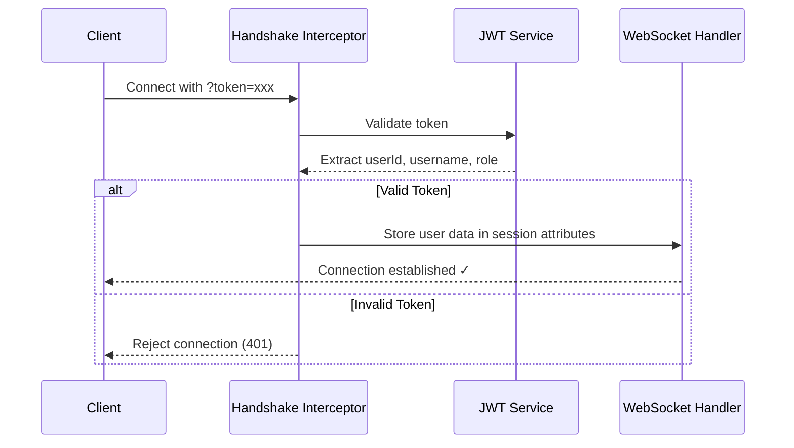

## Introduction

The Justina Backend provides WebSocket endpoints for real-time bidirectional communication between clients and the server. WebSockets enable:

- **Live telemetry streaming** from surgical simulations
- **Instant notifications** to AI systems when surgeries complete
- **Low-latency data transfer** for responsive user experiences

## WebSocket Base URL

All WebSocket connections are established at:

```
ws://localhost:8080/ws/{endpoint}
```

For secure connections (recommended in production):

```
wss://your-domain.com/ws/{endpoint}
```

## Available Channels

| Endpoint | Purpose | Required Role |
|----------|---------|---------------|
| `/ws/simulation` | Stream surgical telemetry data in real-time | ROLE_SURGEON |
| `/ws/ai` | Receive surgery completion notifications | ROLE_AI |

## Authentication

WebSocket connections require JWT authentication via **query parameter**:

```
ws://localhost:8080/ws/simulation?token=<your-jwt-token>
```

### Why Query Parameters?

Unlike HTTP requests, WebSocket handshakes don't easily support custom headers. The token is passed as a query parameter and validated during the handshake phase before the connection is established.

### Authentication Flow



<Steps>
  <Step title="Extract Token">
    Parse `token` parameter from WebSocket URL query string
  </Step>
  <Step title="Validate JWT">
    Verify token signature, expiration, and issuer
  </Step>
  <Step title="Extract Claims">
    Retrieve `userId`, `username`, and `role` from token payload
  </Step>
  <Step title="Store Attributes">
    Save user information in WebSocket session attributes:
    - `SURGEON_ID` - User's UUID
    - `USERNAME` - User's username
    - `ROLE` - User's role (ROLE_SURGEON or ROLE_AI)
  </Step>
  <Step title="Authorize Connection">
    Allow connection if token is valid, reject otherwise
  </Step>
</Steps>

## Connection Examples

<CodeGroup>

```javascript JavaScript/TypeScript
const token = 'eyJhbGciOiJIUzI1NiIsInR5cCI6IkpXVCJ9...';

// Connect to simulation channel
const simulationWs = new WebSocket(
  `ws://localhost:8080/ws/simulation?token=${token}`
);

simulationWs.onopen = () => {
  console.log('Connected to simulation channel');
};

simulationWs.onerror = (error) => {
  console.error('WebSocket error:', error);
};

simulationWs.onclose = (event) => {
  console.log('Connection closed:', event.code, event.reason);
};
```

```python Python (websocket-client)
import websocket
import json

token = "eyJhbGciOiJIUzI1NiIsInR5cCI6IkpXVCJ9..."

def on_open(ws):
    print("Connected to simulation channel")

def on_error(ws, error):
    print(f"WebSocket error: {error}")

def on_close(ws, close_status_code, close_msg):
    print(f"Connection closed: {close_status_code} - {close_msg}")

ws = websocket.WebSocketApp(
    f"ws://localhost:8080/ws/simulation?token={token}",
    on_open=on_open,
    on_error=on_error,
    on_close=on_close
)

ws.run_forever()
```

```java Java (Java-WebSocket)
import org.java_websocket.client.WebSocketClient;
import org.java_websocket.handshake.ServerHandshake;
import java.net.URI;

String token = "eyJhbGciOiJIUzI1NiIsInR5cCI6IkpXVCJ9...";
URI uri = new URI("ws://localhost:8080/ws/simulation?token=" + token);

WebSocketClient client = new WebSocketClient(uri) {
    @Override
    public void onOpen(ServerHandshake handshake) {
        System.out.println("Connected to simulation channel");
    }

    @Override
    public void onMessage(String message) {
        System.out.println("Received: " + message);
    }

    @Override
    public void onClose(int code, String reason, boolean remote) {
        System.out.println("Connection closed: " + reason);
    }

    @Override
    public void onError(Exception ex) {
        System.err.println("WebSocket error: " + ex.getMessage());
    }
};

client.connect();
```

</CodeGroup>

## Connection Security

### Token Validation

<Warning>
Expired or invalid tokens result in immediate connection rejection with `POLICY_VIOLATION` status.
</Warning>

The handshake interceptor validates:
- Token signature (HMAC-SHA256)
- Token expiration (24-hour validity)
- Token issuer (`Justina_Backend`)
- Required claims (`userId`, `role`)

### Role-Based Access

Connections are restricted by role:

- `/ws/simulation` - Only `ROLE_SURGEON` can connect
- `/ws/ai` - Only `ROLE_AI` can connect

Attempting to connect to a channel without the required role results in `POLICY_VIOLATION` closure.

## WebSocket Close Status Codes

| Code | Reason | Description |
|------|--------|-------------|
| `1000` | Normal Closure | Connection closed cleanly |
| `1002` | Protocol Error | WebSocket protocol violation |
| `1003` | Bad Data | Invalid message format (e.g., malformed JSON) |
| `1008` | Policy Violation | Authentication failure or insufficient permissions |
| `1011` | Internal Error | Server-side error during message processing |

## Message Format

All WebSocket messages use **JSON format**. Each channel has specific message schemas:

### Simulation Channel
See [Simulation Channel](/api/simulation-channel) for telemetry message formats.

### AI Channel
See [AI Channel](/api/ai-channel) for notification message formats.

## Connection Lifecycle

<Steps>
  <Step title="Handshake">
    Client initiates connection with JWT token in query parameter
  </Step>
  <Step title="Authentication">
    Server validates token and extracts user information
  </Step>
  <Step title="Connection Established">
    WebSocket connection is opened if authentication succeeds
  </Step>
  <Step title="Message Exchange">
    Client and server exchange JSON messages bidirectionally
  </Step>
  <Step title="Closure">
    Either party can close the connection gracefully
  </Step>
</Steps>

## Error Handling

### Authentication Errors

```javascript
const ws = new WebSocket('ws://localhost:8080/ws/simulation?token=invalid');

ws.onclose = (event) => {
  if (event.code === 1008) {
    console.error('Authentication failed: Invalid or expired token');
    // Redirect to login or refresh token
  }
};
```

### Message Validation Errors

```javascript
ws.onclose = (event) => {
  if (event.code === 1003) {
    console.error('Bad data sent: Message validation failed');
    // Check message format and required fields
  }
};
```

## Best Practices

<Steps>
  <Step title="Handle Reconnection">
    Implement automatic reconnection logic with exponential backoff
  </Step>
  <Step title="Validate Messages">
    Ensure all outgoing messages match the expected JSON schema
  </Step>
  <Step title="Monitor Connection State">
    Track connection status and notify users of disconnections
  </Step>
  <Step title="Secure Tokens">
    Never log or expose JWT tokens in error messages
  </Step>
  <Step title="Use WSS in Production">
    Always use `wss://` (WebSocket Secure) over HTTPS domains
  </Step>
</Steps>

## CORS Configuration

WebSocket endpoints allow connections from all origins (`*`). For production deployments, configure specific allowed origins in `WebSocketConfig.java`:

```java
registry.addHandler(simulationHandler, "/ws/simulation")
    .addInterceptors(handshakeInterceptor)
    .setAllowedOrigins("https://your-frontend-domain.com");
```

## Troubleshooting

### Connection Immediately Closes

**Cause**: Invalid or missing JWT token

**Solution**: Verify token is included in URL and hasn't expired

### "POLICY_VIOLATION" Error

**Cause**: Insufficient role permissions or authentication failure

**Solution**: Ensure token has the correct role for the channel

### Message Not Received

**Cause**: Invalid JSON format or missing required fields

**Solution**: Validate message structure against channel documentation

## Next Steps

<CardGroup cols={2}>
  <Card title="Simulation Channel" icon="microscope" href="/api/simulation-channel">
    Stream telemetry data from surgical simulations
  </Card>
  <Card title="AI Channel" icon="brain-circuit" href="/api/ai-channel">
    Receive real-time surgery completion notifications
  </Card>
</CardGroup>
