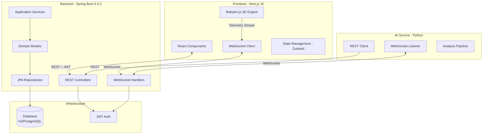
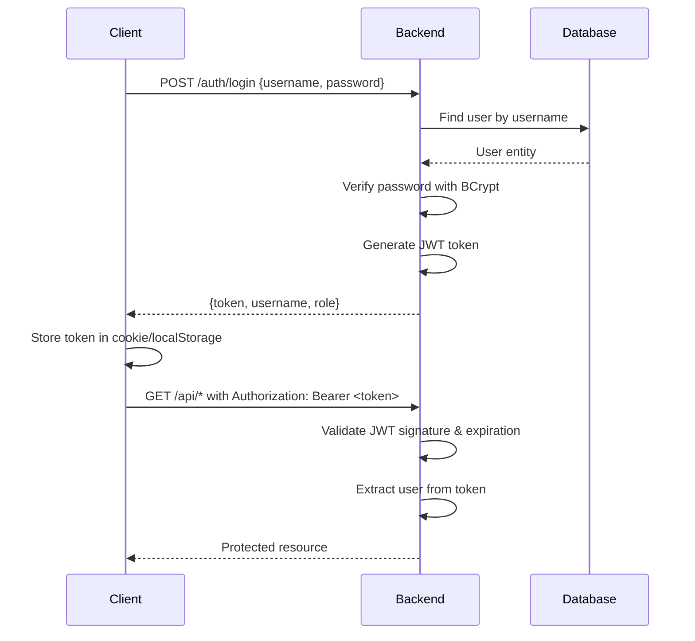
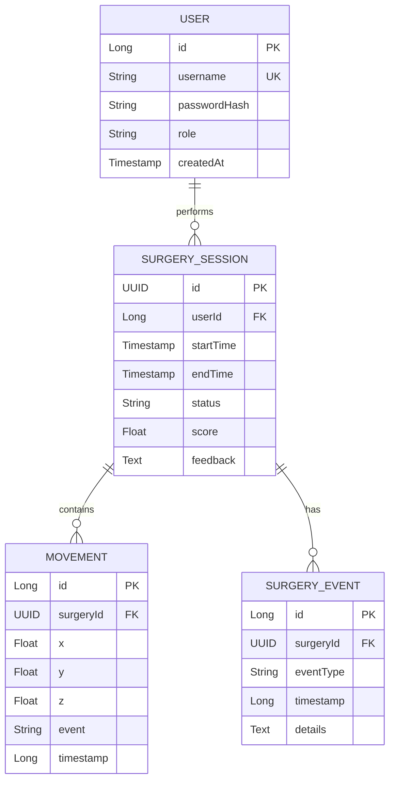

## Architecture Overview

Justina is built on a **Clean/Hexagonal Architecture** pattern, promoting separation of concerns, testability, and maintainability. The system consists of three major components communicating via REST APIs and WebSocket connections.



## Clean Architecture Principles

The backend follows Robert C. Martin's Clean Architecture with four distinct layers:

### Layer Diagram

```
┌─────────────────────────────────────────────────────────────────────┐
│                     PRESENTATION LAYER                              │
│  ┌─────────────────┐  ┌─────────────────┐  ┌─────────────────────┐ │
│  │ REST Controllers│  │ WebSocket       │  │ Security            │ │
│  │                 │  │ Handlers        │  │ Filters             │ │
│  └────────┬────────┘  └────────┬────────┘  └──────────┬──────────┘ │
└───────────┼─────────────────────┼─────────────────────┼─────────────┘
            │                     │                     │
            ▼                     ▼                     ▼
┌─────────────────────────────────────────────────────────────────────┐
│                      APPLICATION LAYER                              │
│  ┌──────────────────────────────────────────────────────────────┐  │
│  │                    Application Services                       │  │
│  │  ┌─────────────┐  ┌─────────────┐  ┌─────────────────────┐   │  │
│  │  │ AuthService │  │SurgeryService│ │ TelemetryService   │   │  │
│  │  └─────────────┘  └─────────────┘  └─────────────────────┘   │  │
│  └──────────────────────────────────────────────────────────────┘  │
│                           PORTS (Interfaces)                        │
└──────────────────────────────┬──────────────────────────────────────┘
                               │
                               ▼
┌─────────────────────────────────────────────────────────────────────┐
│                        DOMAIN LAYER                                 │
│  ┌────────────────┐  ┌────────────────┐  ┌──────────────────────┐  │
│  │  Core Models   │  │      DTOs      │  │   Domain Logic       │  │
│  │  - User        │  │- AuthResponse  │  │  - Business Rules    │  │
│  │  - Surgery     │  │- TelemetryDTO  │  │  - Validations       │  │
│  │  - Movement    │  │- TrajectoryDTO │  │  - Calculations      │  │
│  └────────────────┘  └────────────────┘  └──────────────────────┘  │
│  ┌──────────────────────────────────────────────────────────────┐  │
│  │               Repository Interfaces (Ports)                   │  │
│  └──────────────────────────────────────────────────────────────┘  │
└──────────────────────────────┬──────────────────────────────────────┘
                               │
                               ▼
┌─────────────────────────────────────────────────────────────────────┐
│                    INFRASTRUCTURE LAYER                             │
│  ┌──────────────────────────────────────────────────────────────┐  │
│  │                        ADAPTERS                               │  │
│  │  ┌─────────────────┐  ┌─────────────────┐  ┌─────────────┐  │  │
│  │  │ JPA/Hibernate   │  │ JWT Security    │  │ WebSocket   │  │  │
│  │  │ PostgreSQL/H2   │  │ BCrypt Encoder  │  │ STOMP       │  │  │
│  │  └─────────────────┘  └─────────────────┘  └─────────────┘  │  │
│  └──────────────────────────────────────────────────────────────┘  │
└─────────────────────────────────────────────────────────────────────┘
```

### Benefits of This Architecture

<CardGroup cols={2}>
  <Card title="Independence" icon="circle-nodes">
    Business logic is independent of frameworks, UI, database, and external agencies
  </Card>
  <Card title="Testability" icon="flask">
    Business rules can be tested without UI, database, web server, or external elements
  </Card>
  <Card title="UI Independence" icon="desktop">
    UI can change without changing the rest of the system (e.g., swap React for Angular)
  </Card>
  <Card title="Database Independence" icon="database">
    Can swap H2 for PostgreSQL without touching business logic
  </Card>
</CardGroup>

## Backend Architecture

### Technology Stack

| Component | Technology | Version | Purpose |
|-----------|------------|---------|----------|
| Framework | Spring Boot | 4.0.2 | Application framework |
| Language | Java | 21 | Primary language |
| Build Tool | Maven | 3.9+ | Dependency management |
| ORM | Hibernate (JPA) | - | Database abstraction |
| Security | Spring Security + JWT | - | Authentication & authorization |
| WebSocket | Spring WebSocket | - | Real-time communication |
| API Docs | SpringDoc OpenAPI | 2.8.6 | API documentation |
| Database (Dev) | H2 | - | In-memory database |
| Database (Prod) | PostgreSQL | 15+ | Production database |

### Project Structure

```java
src/main/java/project/Justina/
├── JustinaApplication.java              // Application entry point
│
├── application/                          // APPLICATION LAYER
│   ├── ports/                           // Port interfaces
│   └── service/                         // Business logic services
│       ├── AuthService.java            // Authentication service
│       └── SurgeryService.java         // Surgery management
│
├── domain/                              // DOMAIN LAYER
│   ├── model/                          // Core business entities
│   │   ├── User.java                   // User entity
│   │   ├── SurgerySession.java         // Surgery session
│   │   ├── Movement.java               // Movement point
│   │   └── SurgeryEvent.java          // Critical events
│   ├── dto/                            // Data transfer objects
│   │   ├── LoginRequestDTO.java
│   │   ├── AuthResponseDTO.java
│   │   ├── TelemetryDTO.java
│   │   └── TrajectoryDTO.java
│   ├── repository/                     // Repository interfaces
│   │   ├── UserRepository.java
│   │   └── SurgeryRepository.java
│   └── exception/                      // Domain exceptions
│       ├── AuthException.java
│       └── SurgeryNotFoundException.java
│
└── infrastructure/                      // INFRASTRUCTURE LAYER
    ├── adapter/                        // Implementation adapters
    │   ├── entity/                     // JPA entities
    │   ├── mapper/                     // Entity-DTO mappers
    │   └── repository/                 // JPA repository implementations
    ├── config/                         // Spring configuration
    │   ├── DataInitializer.java       // Initialize default users
    │   └── OpenApiConfig.java         // Swagger configuration
    ├── controller/                     // REST endpoints
    │   ├── AuthController.java        // Authentication endpoints
    │   ├── SurgeryController.java     // Surgery endpoints
    │   └── GlobalExceptionHandler.java // Error handling
    ├── security/                       // Security infrastructure
    │   ├── SecurityConfig.java        // Security configuration
    │   ├── JwtService.java            // JWT token management
    │   ├── JwtAuthenticationFilter.java // JWT validation filter
    │   └── ApplicationConfig.java     // Bean configurations
    └── websocket/                      // WebSocket infrastructure
        ├── WebSocketConfig.java       // WebSocket configuration
        ├── SimulationWebSocketHandler.java // Surgeon connection
        ├── AIWebSocketHandler.java    // AI service connection
        └── HandshakeInterceptorImpl.java // WebSocket security
```

### Key Design Patterns

#### 1. Dependency Injection

```java:backend/src/main/java/project/Justina/application/service/AuthService.java
@Service
public class AuthService {
    private final UserRepository userRepository;
    private final PasswordEncoder passwordEncoder;
    private final JwtService jwtService;
    
    // Constructor injection (Spring auto-wires dependencies)
    @Autowired
    public AuthService(
        UserRepository userRepository,
        PasswordEncoder passwordEncoder,
        JwtService jwtService
    ) {
        this.userRepository = userRepository;
        this.passwordEncoder = passwordEncoder;
        this.jwtService = jwtService;
    }
    
    public AuthResponseDTO login(LoginRequestDTO request) {
        // Business logic...
    }
}
```

#### 2. Repository Pattern

```java
// Domain layer - Interface (Port)
public interface UserRepository {
    Optional<User> findByUsername(String username);
    User save(User user);
}

// Infrastructure layer - Implementation (Adapter)
@Repository
public interface UserJpaRepository 
    extends JpaRepository<UserEntity, Long>, UserRepository {
    // JPA provides implementation automatically
}
```

#### 3. DTO Pattern

Separate internal domain models from external API contracts:

```java
// Domain model (internal)
@Entity
public class User {
    private Long id;
    private String username;
    private String passwordHash;
    private String role;
    // Internal implementation details
}

// DTO (external API)
public record AuthResponseDTO(
    String token,
    String username,
    String role
) {
    // Only expose what clients need
}
```

## Frontend Architecture

### Technology Stack

| Component | Technology | Version | Purpose |
|-----------|------------|---------|----------|
| Framework | Next.js | 16.1.6 | React framework |
| Language | TypeScript | 5.x | Type-safe JavaScript |
| UI Library | React | 19.2.3 | Component library |
| 3D Engine | Babylon.js | 8.51.2 | WebGL 3D rendering |
| State Management | Zustand | 5.0.11 | Global state |
| WebSocket | STOMP.js | 7.3.0 | WebSocket protocol |
| UI Components | Radix UI | - | Accessible components |
| Styling | Tailwind CSS | 4.1.18 | Utility-first CSS |

### Application Structure

```typescript
frontend/
├── app/
│   ├── components/                      // React components
│   │   ├── Scene.tsx                   // Babylon.js 3D scene
│   │   ├── UserDropdown.tsx            // User menu
│   │   ├── nav.tsx                     // Navigation bar
│   │   ├── dashboard/
│   │   │   └── ModuleCard.tsx         // Dashboard cards
│   │   └── ui/                         // Reusable UI components
│   │       ├── button.tsx
│   │       ├── card.tsx
│   │       └── input.tsx
│   │
│   ├── lib/                            // Utility libraries
│   │   ├── api.ts                     // REST API client
│   │   ├── websocketConfig.ts         // WebSocket setup
│   │   ├── enviarTelemetria.ts        // Telemetry sender
│   │   └── config.ts                  // Environment config
│   │
│   ├── store/                          // State management
│   │   └── surgeryStore.ts            // Surgery state (Zustand)
│   │
│   ├── login/
│   │   ├── page.tsx                   // Login page
│   │   └── login.actions.ts           // Login logic
│   │
│   ├── dashboard/
│   │   ├── page.tsx                   // Dashboard page
│   │   └── module.data.ts             // Module definitions
│   │
│   ├── layout.tsx                      // Root layout
│   └── page.tsx                        // Home page
│
├── public/                              // Static assets
├── package.json                         // Dependencies
└── tsconfig.json                        // TypeScript config
```

### 3D Simulation with Babylon.js

The surgical simulation is powered by Babylon.js, a powerful WebGL 3D engine.

```typescript:frontend/app/components/Scene.tsx
import * as BABYLON from "@babylonjs/core";
import { useEffect, useRef } from "react";

export default function BabylonScene() {
  const canvasRef = useRef<HTMLCanvasElement>(null);
  const websocketRef = useRef<WebSocket | null>(null);

  useEffect(() => {
    if (!canvasRef.current) return;

    // Create Babylon.js engine
    const engine = new BABYLON.Engine(canvasRef.current, true);
    const scene = new BABYLON.Scene(engine);

    // Setup camera, lights, and 3D objects
    const camera = new BABYLON.ArcRotateCamera(
      "camera",
      Math.PI / 2,
      Math.PI / 2,
      10,
      BABYLON.Vector3.Zero(),
      scene
    );
    camera.attachControl(canvasRef.current, true);

    // Load surgical models, instruments, etc.
    // ...

    // Render loop
    engine.runRenderLoop(() => {
      scene.render();
    });

    // Connect WebSocket for telemetry
    conectarWebSocket();

    return () => {
      engine.dispose();
      websocketRef.current?.close();
    };
  }, []);

  return <canvas ref={canvasRef} className="w-full h-full" />;
}
```

### WebSocket Integration

Real-time telemetry streaming from the 3D simulation:

```typescript:frontend/app/lib/websocketConfig.ts
let websocket: WebSocket | null = null;

export function conectarWebSocket(token: string) {
  const WS_URL = process.env.NEXT_PUBLIC_WS_URL;
  websocket = new WebSocket(`${WS_URL}/ws/simulation?token=${token}`);

  websocket.onopen = () => {
    console.log('🔌 WebSocket connected - Simulation started');
    // Send START event
    enviarTelemetria(0, 0, 0, 'START');
  };

  websocket.onmessage = (event) => {
    const message = JSON.parse(event.data);
    if (message.status === 'SAVED') {
      console.log('💾 Surgery saved:', message.surgeryId);
      localStorage.setItem('lastSurgeryId', message.surgeryId);
    }
  };

  websocket.onerror = (error) => {
    console.error('❌ WebSocket error:', error);
  };

  websocket.onclose = () => {
    console.log('🔌 WebSocket disconnected');
  };
}

export function enviarTelemetria(
  x: number,
  y: number,
  z: number,
  event: string
) {
  if (websocket?.readyState === WebSocket.OPEN) {
    const telemetria = {
      coordinates: { x, y, z },
      event: event, // START, MOVE, FINISH
      timestamp: new Date().toISOString()
    };
    websocket.send(JSON.stringify(telemetria));
  }
}
```

### State Management

Using Zustand for lightweight, performant state management:

```typescript
import { create } from 'zustand';

interface SurgeryStore {
  currentEvent: string;
  surgeryId: string | null;
  setEvent: (event: string) => void;
  setSurgeryId: (id: string) => void;
}

export const useSurgeryStore = create<SurgeryStore>((set) => ({
  currentEvent: 'IDLE',
  surgeryId: null,
  setEvent: (event) => set({ currentEvent: event }),
  setSurgeryId: (id) => set({ surgeryId: id })
}));
```

## AI Service Architecture

### Technology Stack

| Component | Technology | Purpose |
|-----------|------------|----------|
| Language | Python 3.x | Core language |
| HTTP Client | requests | REST API calls |
| Data Processing | pandas, numpy | Trajectory analysis |
| WebSocket | websocket-client | Real-time notifications |
| Web Server | Flask | Health check endpoint |
| Config | python-dotenv | Environment variables |

### Pipeline Architecture

The AI service implements a **5-step analysis pipeline** for surgical evaluation:

```python:ia/analysis_pipeline.py
def run_pipeline(trajectory_data: Dict) -> Tuple[float, str]:
    """
    COMPLETE 5-STEP ANALYSIS PIPELINE
    """
    # STEP 1: Data Ingestion & Cleaning
    df = _paso1_ingestar_y_limpiar(trajectory_data)
    
    # STEP 2: Dexterity Metrics (Physics-based)
    metricas = _paso2_calcular_destreza(df)
    
    # STEP 3: Benchmarking Against Gold Standard
    benchmarking = _paso3_benchmarking(df)
    
    # STEP 4: Risk Analysis
    riesgo = _paso4_analizar_riesgo(df)
    
    # STEP 5: Intelligent Feedback Generation
    score, feedback = _paso5_generar_feedback(metricas, benchmarking, riesgo)
    
    return score, feedback
```

#### Step 1: Data Ingestion & Cleaning

```python
def _paso1_ingestar_y_limpiar(trajectory_data: Dict) -> pd.DataFrame:
    movements = trajectory_data["movements"]
    df = pd.DataFrame([{
        "x": m["coordinates"][0],
        "y": m["coordinates"][1],
        "z": m["coordinates"][2] if len(m["coordinates"]) > 2 else 0,
        "event": m["event"],
        "timestamp": m["timestamp"]
    } for m in movements])
    
    # Sort by timestamp and calculate relative time
    df = df.sort_values("timestamp").reset_index(drop=True)
    df["t"] = (df["timestamp"] - df["timestamp"].iloc[0]) / 1000.0  # seconds
    df["dt"] = df["t"].diff().fillna(0)
    
    return df
```

#### Step 2: Dexterity Metrics

Calculates physics-based surgical performance metrics:

```python
def _paso2_calcular_destreza(df: pd.DataFrame) -> Dict:
    # Calculate position differences
    dx = df["x"].diff().fillna(0)
    dy = df["y"].diff().fillna(0)
    dz = df["z"].diff().fillna(0)
    dist = np.sqrt(dx**2 + dy**2 + dz**2)
    
    # Velocity: v = distance / time
    v = dist / df["dt"].replace(0, np.inf)
    v = v.replace(np.inf, 0)
    
    # Acceleration: a = dv / dt
    a = v.diff() / df["dt"].replace(0, np.inf)
    a = a.replace(np.inf, 0)
    
    # Jerk: j = da / dt (measures smoothness)
    j = a.diff() / df["dt"].replace(0, np.inf)
    j = j.replace(np.inf, 0)
    
    # Movement economy: total distance / direct distance
    total_dist = dist.sum()
    p1 = np.array([df["x"].iloc[0], df["y"].iloc[0], df["z"].iloc[0]])
    p2 = np.array([df["x"].iloc[-1], df["y"].iloc[-1], df["z"].iloc[-1]])
    direct_dist = np.linalg.norm(p2 - p1)
    economia = total_dist / direct_dist if direct_dist > 0 else 1.0
    
    return {
        "economia": economia,        # Lower is better (ideal < 1.2)
        "v_avg": v.mean(),          # Average velocity
        "a_max": a.abs().max(),     # Maximum acceleration
        "j_avg": j.abs().mean(),    # Average jerk (smoothness)
        "total_dist": total_dist,
        "duration": df["t"].iloc[-1]
    }
```

#### Step 3: Benchmarking

Compares trajectory against ideal straight-line path:

```python
def _paso3_benchmarking(df: pd.DataFrame) -> Dict:
    p_start = np.array([df["x"].iloc[0], df["y"].iloc[0], df["z"].iloc[0]])
    p_end = np.array([df["x"].iloc[-1], df["y"].iloc[-1], df["z"].iloc[-1]])
    
    def dist_to_line(p, a, b):
        """Calculate perpendicular distance from point to line"""
        if np.all(a == b): return np.linalg.norm(p - a)
        return np.linalg.norm(np.cross(b - a, a - p)) / np.linalg.norm(b - a)
    
    # Calculate deviation for each point
    desviaciones = [
        dist_to_line(np.array([r.x, r.y, r.z]), p_start, p_end)
        for r in df.itertuples()
    ]
    
    return {
        "desviacion_avg": np.mean(desviaciones),
        "precision": max(0, 100 - np.mean(desviaciones) * 10)  # 0-100 scale
    }
```

#### Step 4: Risk Analysis

```python
def _paso4_analizar_riesgo(df: pd.DataFrame) -> Dict:
    # Count critical events
    tumor_touches = (df["event"] == "TUMOR_TOUCH").sum()
    hemorrhages = (df["event"] == "HEMORRHAGE").sum()
    
    # Identify problem quadrants
    mid_x = (df["x"].max() + df["x"].min()) / 2
    mid_y = (df["y"].max() + df["y"].min()) / 2
    
    problemas = df[df["event"].isin(["TUMOR_TOUCH", "HEMORRHAGE"])]
    cuadrantes_criticos = []
    if not problemas.empty:
        for p in problemas.itertuples():
            pos = ("Sup" if p.y > mid_y else "Inf") + \
                  ("-Der" if p.x > mid_x else "-Izq")
            if pos not in cuadrantes_criticos:
                cuadrantes_criticos.append(pos)
    
    return {
        "touches": int(tumor_touches),
        "hemorrhages": int(hemorrhages),
        "cuadrantes": cuadrantes_criticos
    }
```

#### Step 5: Feedback Generation

```python
def _paso5_generar_feedback(m: Dict, b: Dict, r: Dict) -> Tuple[float, str]:
    # Calculate final score
    score = 100.0
    score -= r["touches"] * 8           # -8 per tumor contact
    score -= r["hemorrhages"] * 15      # -15 per hemorrhage
    if m["economia"] > 1.5: score -= 10  # -10 for inefficient movement
    score = max(0, min(100, score))
    
    # Generate feedback markdown
    status = (
        "🌟 EXCELENTE" if score >= 90 else
        "✅ BUENO" if score >= 75 else
        "⚠️ MEJORABLE" if score >= 60 else
        "❌ DEFICIENTE"
    )
    
    feedback = f"""
### {status} - Score: {score:.1f}/100

#### 🚨 CRITICAL ALERTS
- Hemorrhages: {r["hemorrhages"]} {"(REVIEW TECHNIQUE)" if r["hemorrhages"] > 0 else "(None)"}
- Tumor Contacts: {r["touches"]}
- Risk Quadrants: {", ".join(r["cuadrantes"]) if r["cuadrantes"] else "None"}

#### 📊 DEXTERITY METRICS
- **Movement Economy:** {m["economia"]:.2f}x (Ideal < 1.2x)
- **Smoothness (Avg Jerk):** {m["j_avg"]:.2f}
- **Precision vs Gold Standard:** {b["precision"]:.1f}%

#### 📈 STATISTICS
- **Total Duration:** {m["duration"]:.1f}s
- **Distance Traveled:** {m["total_dist"]:.2f} units
- **Average Velocity:** {m["v_avg"]:.2f} u/s

#### 💡 RECOMMENDATIONS
"""
    
    # Add specific recommendations
    if r["hemorrhages"] > 0:
        feedback += "- Prioritize vascular control in critical quadrants.\n"
    if m["economia"] > 1.8:
        feedback += "- Plan more direct trajectories to reduce fatigue.\n"
    if b["precision"] < 70:
        feedback += "- Maintain better stability in executing ideal path.\n"
    if score < 80:
        feedback += "- Increase simulator practice to improve motor coordination.\n"
    
    return score, feedback.strip()
```

### WebSocket Client

The AI service listens for new surgery notifications:

```python:ia/websocket_client.py
class AIWebSocketClient:
    def on_message(self, ws, message):
        data = json.loads(message)
        
        # Check if it's a new surgery notification
        if data.get("event") == "NEW_SURGERY":
            surgery_id = data.get("surgeryId")
            print(f"🔔 New surgery detected: {surgery_id}")
            
            # Process in separate thread
            thread = threading.Thread(
                target=self.procesar_cirugia_async,
                args=(surgery_id,)
            )
            thread.daemon = True
            thread.start()
    
    def procesar_cirugia_async(self, surgery_id):
        # 1. Fetch trajectory data
        trajectory_data = self.client.get_trajectory(surgery_id)
        
        # 2. Analyze with pipeline
        score, feedback = run_pipeline(trajectory_data)
        
        # 3. Send results back
        self.client.send_analysis(surgery_id, score, feedback)
```

## Communication Protocols

### REST API Endpoints

#### Authentication

```bash
POST /api/v1/auth/login
POST /api/v1/auth/register
GET  /api/v1/auth/me
```

#### Surgery Management

```bash
GET  /api/v1/surgeries/{id}/trajectory    # Get movement data
POST /api/v1/surgeries/{id}/analysis      # Submit AI analysis
```

### WebSocket Endpoints

#### Simulation Stream (Surgeons)

```
ws://backend:8080/ws/simulation?token=<JWT>
```

**Client → Server (Telemetry)**:
```json
{
  "coordinates": {"x": 10.5, "y": 20.3, "z": 15.7},
  "event": "MOVE",
  "timestamp": "2024-01-15T10:30:00Z"
}
```

**Server → Client (Confirmation)**:
```json
{
  "status": "SAVED",
  "surgeryId": "550e8400-e29b-41d4-a716-446655440000"
}
```

#### AI Notification Channel

```
ws://backend:8080/ws/ai?token=<JWT>
```

**Server → AI (New Surgery)**:
```json
{
  "event": "NEW_SURGERY",
  "surgeryId": "550e8400-e29b-41d4-a716-446655440000"
}
```

## Security Architecture

### JWT Authentication Flow



### Role-Based Access Control

```java:backend/src/main/java/project/Justina/infrastructure/security/SecurityConfig.java
@Configuration
@EnableWebSecurity
public class SecurityConfig {
    
    @Bean
    public SecurityFilterChain securityFilterChain(HttpSecurity http) throws Exception {
        http
            .csrf(csrf -> csrf.disable())
            .cors(cors -> cors.configurationSource(corsConfigurationSource()))
            .authorizeHttpRequests(auth -> auth
                // Public endpoints
                .requestMatchers("/api/v1/auth/**").permitAll()
                .requestMatchers("/swagger-ui/**", "/v3/api-docs/**").permitAll()
                
                // Surgeon-only endpoints
                .requestMatchers("/api/v1/surgeries/*/trajectory")
                    .hasAnyRole("SURGEON", "IA")
                
                // AI-only endpoints
                .requestMatchers("/api/v1/surgeries/*/analysis")
                    .hasRole("IA")
                
                // All other endpoints require authentication
                .anyRequest().authenticated()
            )
            .sessionManagement(session -> session
                .sessionCreationPolicy(SessionCreationPolicy.STATELESS)
            )
            .addFilterBefore(jwtAuthFilter, UsernamePasswordAuthenticationFilter.class);
        
        return http.build();
    }
}
```

## Database Schema

### Entity Relationship Diagram



### Example Queries

```java
// Fetch surgery with all movements
SurgerySession surgery = surgeryRepository.findById(surgeryId)
    .orElseThrow(() -> new SurgeryNotFoundException(surgeryId));

List<Movement> movements = surgery.getMovements(); // Lazy loaded

// Get user's surgeries
List<SurgerySession> surgeries = surgeryRepository
    .findByUserId(userId);

// Get surgeries by status
List<SurgerySession> pending = surgeryRepository
    .findByStatus(SurgeryStatus.PENDING_ANALYSIS);
```

## Performance Considerations

### Backend Optimizations

- **Connection Pooling**: HikariCP for efficient database connections
- **Lazy Loading**: JPA relationships loaded on-demand
- **Caching**: Spring Cache for frequently accessed data
- **Async Processing**: AI analysis runs in separate threads

### Frontend Optimizations

- **Code Splitting**: Next.js automatic route-based splitting
- **Tree Shaking**: Unused code eliminated in production builds
- **WebGL Optimization**: Babylon.js scene optimization
- **State Minimization**: Zustand for lightweight state management

### WebSocket Optimizations

- **Binary Frames**: Efficient data transfer format
- **Compression**: WebSocket compression extension
- **Heartbeat**: Keep-alive pings to maintain connection
- **Reconnection**: Automatic reconnection on disconnect

## Deployment Architecture

### Development

```
┌─────────────┐     ┌─────────────┐     ┌─────────────┐
│  Frontend   │────▶│   Backend   │────▶│  H2 Memory  │
│  :3000      │     │   :8080     │     │  Database   │
└─────────────┘     └─────────────┘     └─────────────┘
                           │
                           ▼
                    ┌─────────────┐
                    │ AI Service  │
                    │  Python     │
                    └─────────────┘
```

### Production (Docker)

```
┌─────────────────────────────────────────────────────────┐
│                     Docker Compose                      │
│                                                         │
│  ┌───────────┐    ┌───────────┐    ┌───────────────┐  │
│  │ Frontend  │───▶│  Backend  │───▶│  PostgreSQL   │  │
│  │  Next.js  │    │Spring Boot│    │   Database    │  │
│  │  :3000    │    │   :8080   │    │    :5432      │  │
│  └───────────┘    └───────────┘    └───────────────┘  │
│                          │                              │
│                          ▼                              │
│                   ┌───────────┐                         │
│                   │AI Service │                         │
│                   │  Python   │                         │
│                   └───────────┘                         │
└─────────────────────────────────────────────────────────┘
```

## Next Steps

<CardGroup cols={2}>
  <Card title="API Reference" icon="code" href="/api/overview">
    Complete endpoint documentation with examples
  </Card>
  <Card title="Deployment Guide" icon="rocket" href="/deployment/prerequisites">
    Deploy Justina to production environments
  </Card>
  <Card title="Features" icon="sparkles" href="/features/simulation">
    Explore platform capabilities
  </Card>
  <Card title="User Guide" icon="book-open" href="/guide/authentication">
    Learn how to use the platform
  </Card>
</CardGroup>