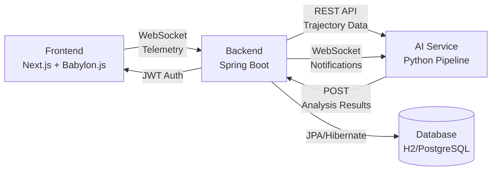

## What is Justina?

Justina is an advanced **surgical simulation platform** designed to revolutionize surgical training through immersive 3D simulations and real-time AI-powered analysis. The platform captures surgical movements, tracks instrument trajectories, and provides immediate feedback to help surgeons improve their skills in a risk-free environment.

<CardGroup cols={2}>
  <Card title="Immersive 3D Simulation" icon="cube">
    High-fidelity surgical simulations powered by Babylon.js with realistic physics and instrument interactions
  </Card>
  <Card title="Real-time Telemetry" icon="chart-line">
    Capture every movement during surgical procedures via WebSocket streaming for instant data analysis
  </Card>
  <Card title="AI-Powered Analysis" icon="brain">
    Advanced 5-step pipeline analyzing surgical dexterity, precision, risk patterns, and providing actionable feedback
  </Card>
  <Card title="Comprehensive Tracking" icon="route">
    Complete trajectory recording with movement patterns, event detection, and performance metrics
  </Card>
</CardGroup>

## Who Is It For?

### Surgical Trainees

Practice complex procedures in a safe environment with immediate feedback on technique, precision, and decision-making. Track improvement over time with detailed performance metrics.

### Medical Educators

Monitor student progress, identify areas requiring additional training, and provide evidence-based guidance using comprehensive surgical data and AI-generated reports.

### Healthcare Institutions

Standardize surgical training programs, ensure competency before live procedures, and maintain objective performance records for certification and continuous improvement.

## Key Benefits

<Note>
**Risk-Free Learning**: Practice complex surgical maneuvers without patient risk, allowing trainees to make mistakes and learn from them in a controlled environment.
</Note>

### Objective Performance Evaluation

Unlike subjective human observation, Justina provides quantitative metrics:

- **Movement Economy**: Measures efficiency of instrument paths (optimal < 1.2x direct distance)
- **Surgical Precision**: Deviation analysis from optimal trajectories
- **Dexterity Metrics**: Velocity, acceleration, and jerk (smoothness) analysis
- **Risk Assessment**: Automatic detection of critical events (hemorrhages, tumor contacts)
- **Time Analysis**: Procedure duration and phase timing

### Real-time Feedback

The AI analysis pipeline processes completed surgeries immediately, providing:

- Performance scores (0-100 scale)
- Critical alerts for dangerous actions
- Specific improvement recommendations
- Quadrant-based risk mapping
- Comparison against ideal surgical patterns

### Scalable Architecture

Built with modern technologies and architectural patterns to ensure reliability:

- Spring Boot 4.0.2 backend with Java 21
- Next.js 16 frontend with React 19
- Python-based AI pipeline with pandas/numpy
- WebSocket real-time communication
- PostgreSQL/H2 database support

## System Architecture Overview

Justina consists of three main components working together:



### Frontend Layer

Built with **Next.js 16** and **TypeScript**, the frontend provides:

- Interactive 3D surgical environment using **Babylon.js 8.51**
- Real-time WebSocket connection for telemetry streaming
- User authentication and session management
- Dashboard for viewing past surgeries and analysis reports
- Responsive UI with Tailwind CSS and Radix UI components

**Key Technologies**: React 19, Babylon.js, STOMP.js, Zustand (state management)

### Backend Layer

The backend is built using **Spring Boot 4.0.2** following Clean/Hexagonal Architecture:

- **Presentation Layer**: REST controllers and WebSocket handlers
- **Application Layer**: Business logic services (AuthService, SurgeryService)
- **Domain Layer**: Core business entities and repository interfaces
- **Infrastructure Layer**: JPA persistence, JWT security, WebSocket configuration

**Key Technologies**: Java 21, Spring Security, Spring Data JPA, JWT, SpringDoc OpenAPI

### AI Analysis Layer

The AI service is a **Python** application that:

1. Listens for new surgery notifications via WebSocket
2. Fetches trajectory data from the backend REST API
3. Processes data through a 5-step analysis pipeline
4. Sends results back to the backend

**Pipeline Steps**:

1. **Data Ingestion**: Clean and normalize trajectory coordinates
2. **Dexterity Metrics**: Calculate velocity, acceleration, jerk, and movement economy
3. **Benchmarking**: Compare against ideal straight-line paths
4. **Risk Analysis**: Detect critical events and map problem areas
5. **Feedback Generation**: Create actionable recommendations and scores

**Key Technologies**: Python 3.x, pandas, numpy, Flask, websocket-client

## Use Cases

### Basic Surgical Training

Trainees perform simulated procedures like tumor resection, practicing fundamental movements:

```typescript
// Frontend captures and streams movement data
function enviarEvento(x: number, y: number, z: number, event: string) {
  if (websocketRef.current?.readyState === WebSocket.OPEN) {
    const telemetria = {
      coordinates: { x, y, z },
      event: event, // START, MOVE, FINISH
      timestamp: new Date().toISOString()
    };
    websocketRef.current.send(JSON.stringify(telemetria));
  }
}
```

### Performance Analytics

Instructors review detailed metrics to identify improvement areas:

```python
# AI pipeline calculates surgical precision
def _paso2_calcular_destreza(df: pd.DataFrame) -> Dict:
    # Calculate velocity (v = distance/time)
    v = dist / df["dt"].replace(0, np.inf)
    
    # Calculate acceleration (a = dv/dt)
    a = v.diff() / df["dt"].replace(0, np.inf)
    
    # Calculate jerk (j = da/dt) - measures smoothness
    j = a.diff() / df["dt"].replace(0, np.inf)
    
    return {
        "economia": total_dist / direct_dist,
        "v_avg": v.mean(),
        "a_max": a.abs().max(),
        "j_avg": j.abs().mean()
    }
```

### Competency Certification

Institutions use objective scores to certify surgical competency:

- Minimum score thresholds (e.g., 75/100 for certification)
- Zero critical events required (no hemorrhages)
- Movement economy below 1.5x
- Completion within time limits

## Communication Flow

Justina uses a hybrid REST + WebSocket architecture:

### Real-time Telemetry (WebSocket)

```bash
# Surgeon connects to simulation endpoint
ws://backend:8080/ws/simulation?token=<JWT_TOKEN>

# Streams movement data
{"coordinates": {"x": 10.5, "y": 20.3, "z": 15.7}, "event": "MOVE", "timestamp": "2024-01-15T10:30:00"}

# Backend notifies AI service
ws://backend:8080/ws/ai?token=<JWT_TOKEN>
{"event": "NEW_SURGERY", "surgeryId": "550e8400-e29b-41d4-a716-446655440000"}
```

### Data Exchange (REST API)

```bash
# AI fetches trajectory data
GET /api/v1/surgeries/{id}/trajectory
Authorization: Bearer <JWT_TOKEN>

# AI sends analysis results
POST /api/v1/surgeries/{id}/analysis
{
  "score": 87.5,
  "feedback": "### ✅ BUENO - Score: 87.5/100\n\n#### 🚨 ALERTAS CRÍTICAS..."
}
```

## Security

Justina implements enterprise-grade security:

- **JWT Authentication**: Stateless token-based auth with BCrypt password hashing
- **Role-Based Access Control**: Separate roles for surgeons (ROLE_SURGEON) and AI system (ROLE_IA)
- **WebSocket Security**: Token validation via query parameters
- **CORS Protection**: Configured origins for frontend access
- **HttpOnly Cookies**: Secure token storage for web clients

## Database Schema

Key entities:

- **User**: Surgeon accounts with credentials and roles
- **SurgerySession**: Surgery metadata (surgeon, start/end times, status)
- **Movement**: Individual trajectory points with coordinates and events
- **SurgeryEvent**: Critical events during procedures (hemorrhages, tumor contacts)

## Next Steps

<CardGroup cols={2}>
  <Card title="Quick Start Guide" icon="rocket" href="/quickstart">
    Get Justina running locally in under 10 minutes
  </Card>
  <Card title="Architecture Deep Dive" icon="diagram-project" href="/architecture">
    Understand the technical implementation details
  </Card>
  <Card title="API Reference" icon="code" href="/api/overview">
    Explore REST endpoints and WebSocket protocols
  </Card>
  <Card title="Deployment Guide" icon="server" href="/deployment/prerequisites">
    Deploy Justina to production environments
  </Card>
</CardGroup>